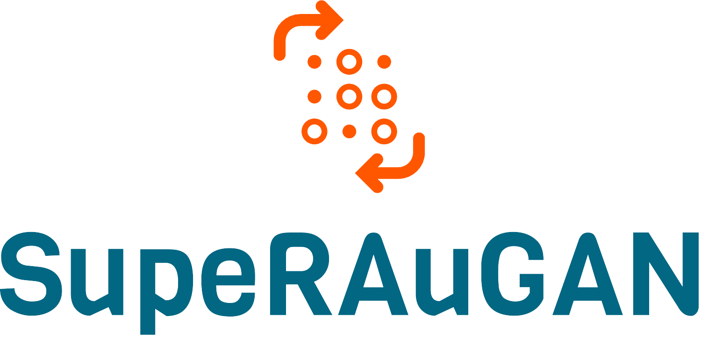

# SupeRAuGAN




## Table of Contents

* [About the Project](#about-the-project)
  * [Built With](#built-with)
* [Getting Started](#getting-started)
  * [Prerequisites](#prerequisites)
  * [Installation](#installation)
* [Usage](#usage)
* [Authors](#authors)
* [Acknowledgments](#acknowledgments)


## About The Project

In ```SupeRAuGAN``` we implement a novel data augmentation technique tailored to Generative Adversarial Networks in order to reduce discriminator overfitting and stabilize training. This technique was first described by [Karras et al.](https://arxiv.org/abs/2006.06676) and applied in an image generation from latent space task. We experiment such approach in a super resolution setting using a slightly modified SRGAN (described in [Ledig et al.](https://arxiv.org/abs/1609.04802)) achieving promising results when using a small amount of data

Original implementation available at [repo](https://github.com/NVlabs/stylegan2-ada-pytorch)

### Built With

* [Python](https://www.python.org/)
* [PyTorch](https://pytorch.org/)
* [pytorch_ssim](https://github.com/Po-Hsun-Su/pytorch-ssim)
* [lpips](https://github.com/richzhang/PerceptualSimilarity)
* [torch-fidelity](https://github.com/toshas/torch-fidelity)


## Getting Started

To get a local copy up and running follow these simple steps.

### Prerequisites

The project provide a ```Pipfile``` file that can be managed with [pipenv](https://github.com/pypa/pipenv).
```pipenv``` installation is **strongly encouraged** in order to avoid dependency/reproducibility problems.

* pipenv
```sh
pip install pipenv
```

### Installation
 
1. Clone the repo
```sh
git clone https://gitlab.com/reddeadrecovery/superaugan
```
2. Install Python dependencies
```sh
pipenv install
```

## Usage
Here's a brief description of each and every file in the repo:

* ```model.py```: Model definition
* ```data_utils.py```: dataset loading utils and preprocessing
* ```train.py```: GAN training file 
* ```test.py```: GAN testing file
* ```augment.py```: Data augmentation pipeline (taken from [here](https://github.com/NVlabs/stylegan2-ada-pytorch))

Folders ```torch_utils``` and ```dnnlib``` are vendored dependencies of ```augment.py```

## Authors

* [**Alberto Baldrati**](https://github.com/ABaldrati)
* [**Giovanni Berti**](https://github.com/giovanniberti)

Under the supervision of [**Leonardo Galteri**](https://scholar.google.it/citations?user=_n2R2bUAAAAJ&hl=it)

## Acknowledgments
Visual and Multimedia Recognition © Course held by Professor [Alberto Del Bimbo](https://scholar.google.it/citations?user=bf2ZrFcAAAAJ) - Computer Engineering Master Degree @[University of Florence](https://www.unifi.it/changelang-eng.html)
